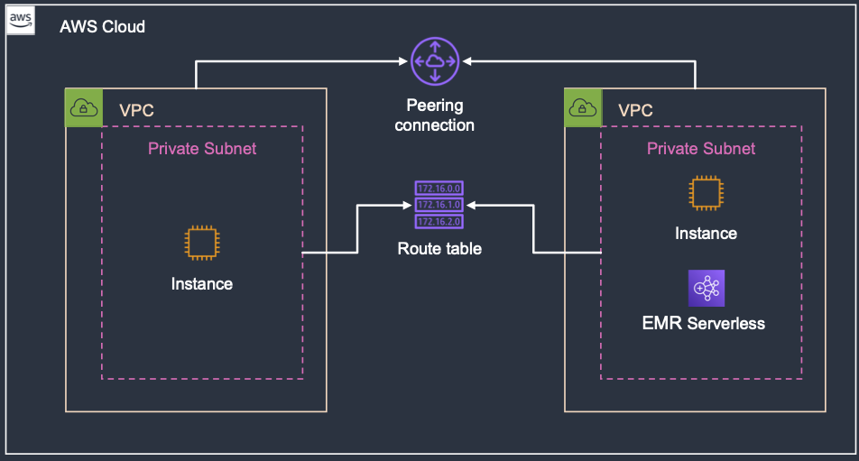

# CDK - EMR Serverless VPC to VPC Connectivity

This is an example app that shows how to create peering between two VPCs to allow an EMR Serverless job to connect to a service in another VPC.

In this example, we create an EC2 instance with Postgres installed in one VPC, a test instance in another VPC for verifying connectivity, and an EMR Serverless app with the appropriate subnets and security group created.



## Usage

Once the infrastructure is deployed, you can copy the sample job to an S3 bucket, replace the placeholders and run the job.

When running the job, it's assumed you already have an S3 bucket and EMR runtime role.

```bash
S3_BUCKET=<your_s3_bucket>
APPLICATION_ID=<app_id_from_cdk>
JOB_ROLE_ARN=<job_role_with_access_to_s3>

# First deploy and copy script to s3
# Your Account and Region must be set
CDK_DEFAULT_ACCOUNT=123456789012 CDK_DEFAULT_REGION=us-west-2 cdk deploy
aws s3 cp pg_connect.py s3://${S3_BUCKET}/code/pyspark

# Now run an EMR Serverless job with the postgresql package
aws emr-serverless start-job-run \
    --application-id $APPLICATION_ID \
    --execution-role-arn $JOB_ROLE_ARN \
    --job-driver '{
        "sparkSubmit": {
            "entryPoint": "s3://'${S3_BUCKET}'/code/pyspark/pg_connect.py",
            "sparkSubmitParameters": "--packages org.postgresql:postgresql:42.4.0"
        }
    }'
```

The job will fail, but you should get an error message that the `users` table doesn't exist that indicates EMR Serverless was able to connect to the postgres instance.

## Overview

This project is set up like a standard Python project.  The initialization
process also creates a virtualenv within this project, stored under the `.venv`
directory.  To create the virtualenv it assumes that there is a `python3`
(or `python` for Windows) executable in your path with access to the `venv`
package. If for any reason the automatic creation of the virtualenv fails,
you can create the virtualenv manually.

To manually create a virtualenv on MacOS and Linux:

```
$ python3 -m venv .venv
```

After the init process completes and the virtualenv is created, you can use the following
step to activate your virtualenv.

```
$ source .venv/bin/activate
```

If you are a Windows platform, you would activate the virtualenv like this:

```
% .venv\Scripts\activate.bat
```

Once the virtualenv is activated, you can install the required dependencies.

```
$ pip install -r requirements.txt
```

At this point you can now synthesize the CloudFormation template for this code.

```
$ cdk synth
```

To add additional dependencies, for example other CDK libraries, just add
them to your `setup.py` file and rerun the `pip install -r requirements.txt`
command.

## Useful commands

 * `cdk ls`          list all stacks in the app
 * `cdk synth`       emits the synthesized CloudFormation template
 * `cdk deploy`      deploy this stack to your default AWS account/region
 * `cdk diff`        compare deployed stack with current state
 * `cdk docs`        open CDK documentation

Enjoy!
