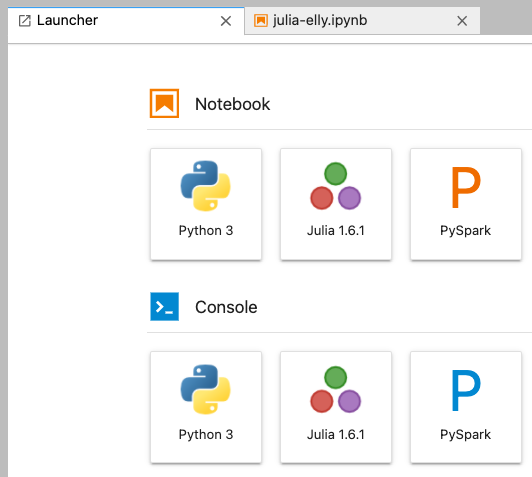

# Julia on EMR

## Installing Julia

Julia can be installed with a bootstrap action when creating your EMR cluster.

### Upload Julia installation scripts to S3

```shell
S3_BUCKET=<YOUR_BUCKET>

aws s3 cp julia-1.6.1.sh s3://<YOUR_BUCKET>/boostrap-actions/julia-1.6.1.sh
aws s3 cp ijulia-kernel.sh s3://<YOUR_BUCKET>/artifacts/steps/ijulia-kernel.sh
```

### Start up an EMR cluster

```shell
ACCOUNT_ID=<YOUR_AWS_ACCOUNT_ID>
REGION=<AWS_REGION>
SUBNET_ID=<EMR_SUBNET>
KEYPAIR=<EC2_KEYPAIR>
INSTALL_SCRIPT="s3://<YOUR_BUCKET>/boostrap-actions/julia-1.6.1.sh"
IJULIA_SCRIPT="s3://<YOUR_BUCKET>/artifacts/steps/ijulia-kernel.sh"

aws emr create-cluster \
--applications Name=Spark Name=Livy Name=JupyterEnterpriseGateway Name=Hive \
--bootstrap-actions '[{"Path":"'${INSTALL_SCRIPT}'","Name":"JuliaInstall"}]' \
--steps '[{"Type":"CUSTOM_JAR","Name":"IJuliaKernelInstall","ActionOnFailure":"TERMINATE_CLUSTER","Jar":"s3://'${REGION}'.elasticmapreduce/libs/script-runner/script-runner.jar","Args":["'${IJULIA_SCRIPT}'"]}]' \
--ebs-root-volume-size 10 \
--instance-type c5.2xlarge \
--instance-count 1 \
--ec2-attributes SubnetId=${SUBNET_ID},KeyName=${KEYPAIR} \
--use-default-roles \
--release-label emr-6.3.0 \
--log-uri s3n://aws-logs-${ACCOUNT_ID}-${REGION}/elasticmapreduce/ \
--name 'DS_julia' \
--scale-down-behavior TERMINATE_AT_TASK_COMPLETION \
--region ${REGION}
```

## Create a new Julia notebook

Now create a new Notebook in EMR connected to the cluster you just made.

When you open the Notebook in JupyterLab, you should see a Julia 1.6.1 icon!



See the `julia-elly.ipynb` notebook for a full example of how to use Elly and Distributed.

The code from that notebook is below.

```julia
import Pkg; Pkg.add("Elly")

yarnhost = readchomp(`hostname -i`)

using Elly

ENV["HADOOP_USER_NAME"] = "hadoop"

yarncm = YarnManager(
    yarnhost=yarnhost,
    rmport=8032,
    schedport=8030,
    launch_timeout=60,
    unmanaged=true     # pass true when running in unmanaged mode
);

using Distributed

env = Dict(
    "JULIA_LOAD_PATH"=>join([Base.LOAD_PATH..., "/usr/local/julia/packages"], ':'),
    "JULIA_DEPOT_PATH"=>join([Base.DEPOT_PATH..., "/usr/local/julia"], ':')
);
addprocs(yarncm; np=8, env=env);

@everywhere using Distributed
@everywhere println(readchomp(`hostname -i`))
```